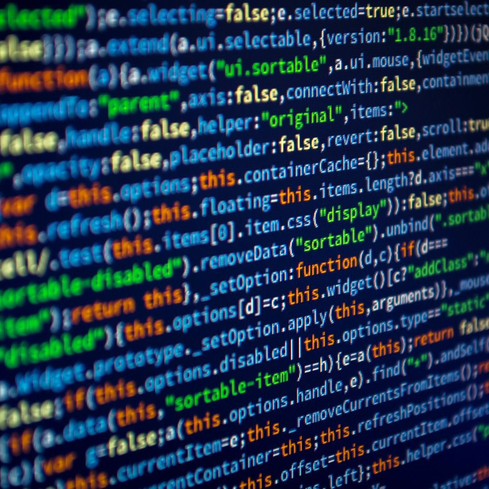

```JavaScript
  console.log("Hello, World!");
```
During the time of writing this essay, it has already been a whole week since the beginning of the semester, rather the *beginning of the end* of my undergraduate education in Computer Engineering at the University of Hawai’i at Mānoa; I graduate this Fall. 

Although, I’m nearing the end of this journey and I have been introduced to a multitude of concepts and tools related to my career path, I’m ashamed to say that I haven’t learned a thing about programming languages that interface with the web, such as JavaScript. 

Regardless, I'm eager to get started.

## Where I'm at
 I wouldn’t say that I am an expert just yet in any programming language, but through certain experiences I have been introduced into the programming world. Through my school curriculum, I became familiar with C and C++. Through summer internships and self teaching, I’ve also learned basic python and BASH scripting as well so seeing pieces of JavaScript code did not seem too alien. My initial thoughts on JavaScript were “This seems familiar”. 

### My Experience 
 Using freecodecamp’s JavaScript Algorithms & Data Structures certification course, I was able to see similarities in the basic syntax of languages I’ve learned. 
 
 The first thing I noticed was that JavaScripts basic function notation, statement ending semicolons, quotations for strings, and comments matched that of C and C++. 

 ```JavaScript
 //This is JavaScript
 function print(){
  console.log("This requires a semicolon!");
 }
```
```C
 //This is C
 int main(){
  printf("This also requires a semicolon!");
  return 0;
 }
```
```C++
 //This is C++
 int main(){
  std::cout << "This also requires one, too!";
  return 0;
 }
``` 


 JS's simple declaration of variables, objects, and shortcuts reminded me of that of pythons. That was the first couple of exercises in the course. Once I went past the halfway point I noticed that I would need to spend more time with some concepts compared to others that I’m already familiar with. There were parts that were foreign to me like it's uses of other programming language within it such as HTML. It will also take time getting familiar with and utilizing built in functions that I haven’t experienced until now.

### Course Layout and Final Thoughts 
In regards to Athletic Software Engineering and WODs or workouts of the day,I have a feeling that this will be one of the more useful components of this class when it comes to learning the material. Being able to think quickly and apply the knowledge is a big part of learning for me. While I’ve only experienced the practice problem, I believe the time constraints will be very beneficial in the long run(despite the possible negative short term effects against my grades).
