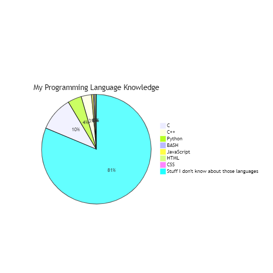

*Interest in software engineering and what kinds of skills and experiences I hope to develop in the future*

  
  My interests in software engineering have slowly developed in the past couple of years. Early on, I was intimidated by the plethora of languages, tools, and resources that were out there. In my freshmen year, I would do the typical student thing and Youtube "What skills do I need as a Software Engineer"? YouTube was littered with videos stating, "Here's why you should learn these ten tools" or "The only software engineering tools you need" or my personal favorite "Why I quit Software Engineering". 

With everyone contradicting one another it was hard to find a language or pathway to dedicate some time into learning. Often times I would find myself in *Tutorial Hell*. A term for seemingly never ending process of learning how to code through tutorials, but never truly understanding. 

### Looking Back
ICS 314 is one of those courses I wish I took earlier on. In hindsight, it would have been handy to have a better understanding of all the tools used in this course. Certain courses early on required a lot of collaboration with group members for software related work. Working with others wasn't too much of a problem for me. What made it much more difficult was the ongoing COVID pandemic which shifted all learning and group work online. Having a better understanding of git and it's version control resources would have made life much easier. 

Having a better understanding of the power of software also makes me wonder if I would have chosen the learning path I did now.

### Hopes for the future
I'm not a fan of self deprecation, but if I were completely honest, my coding knowledge looks alot like this graph.

  

In this case, I may being over estimating myself.

I chose to study computer engineering because I want the flexibility of being able to work in hardware or software computer related roles. With this in mind, I would like to continue to maintain and develop this Professional Portfolio to showcase my achievements and aspirations for future. I would also like to sharpen my skills in regards to Software Engineering as a whole; being able to work with a minimal tech stack. Finally, I would just like to have a skillset that will allow me to work in the office, while travelling, or in the comfort of my own home. I believe software engineering will offer that. 

