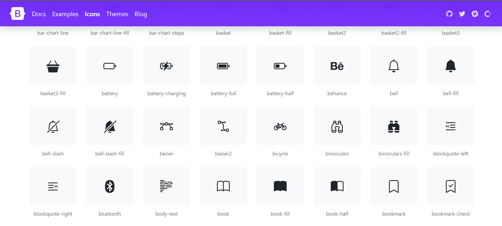
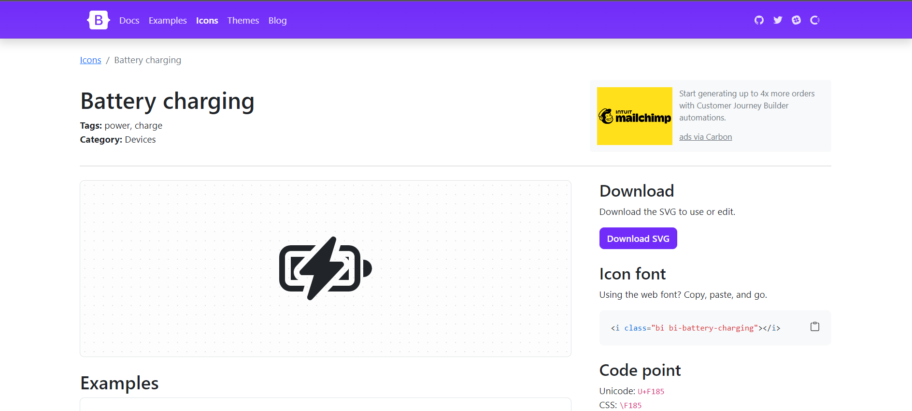

*Why it matters*
### Design Project Mayhem

  
  Despite experiencing numerous assignment, programs, projects, and essays during my time in university, it never fails to surprise me how I can make completing my work more difficult than it should be. I sometimes have a tendency to start writing a paper from top to bottom, even if there are sections below I can complete quicker or write computer programs without thinking of an algorithm first. These are all examples of me failing to utilize study and work patterns that have kept me successful in turning in quality work. Similarly, in the world of computers, we can utilize tried and proven design patterns that prevent us from "Reinventing the wheel" everytime we work on a problem. In the next few sections we will discuss some of these design patterns.

 

### Common Design Patterns
  The term Design Patterns was defined in 1977 by an architect of the name Christopher Alexander. He described it *as a problem that occurs over and over again in our environment and then describes the core of the solution to that problem, in such a way that you can use this solution a million times over, without ever doing it the same way twice.* This definition was profound in that it despite having a new problem, though not necessarily identical to an old one, the older solutions can be used to as a template or guide to how tackling the problem can be structured. A simple example would be the type of roofs built in an environment such as Alaska. Although weather can vary geographically, common sense and experience would tell us that flat roofs would not do well in a snowy environment where pointy roofs are much more reasonable against the weather.

  In terms of software design, A group of software developers, inspired by Christopher Alexander's views on design patterns, published a <a href="">book</a> on software development patterns. The 23 patterns the authors/developers identified could be broken into three types: Creational, Structural, and Behavioral. These are some of those common patterns we can see similar to the roofs of Alaskan homes for architecture. 
  <ol>  
    
    <li>
      <h5>Creational</h5>
      

        Are you creating a web page that requires you to have a hand in every fine detail of the site? Will using a framework hinder this? Then it may be best to use standard CSS and HTML. Maybe you require the opposite and can get the job done using predefined functions and templates? That is where a framework can shine. 
      

    </li>
    <li>
      <h5>Structural</h5>
      

        When working with others, it is best practice to be on the same page on what tools are being utilized for a project. It is a challenge enough to maintain and manage a project with hundreds of lines of code let alone code from team members using different frameworks. In this scenario, it may be best to use the same frameworks that everyone is familiar with. Or if the project is simple enough, not using one at all.
      

    </li>
    <li>
      <h5>Behavioral</h5>
      

        When you are serving a product with a high volume of user activity and engagement, and cannot afford to waste an extra second on shutting down servers, identifying problems, and iterating over edits to clear bugs, support from a framework's team could help remdying that problem. The
      

    </li>
  </ol>
 
<table>
 <tr>
    <th>Creational Design Pattern</th>
    <th>Description</th>
 </tr>
 <tr>
    <td>Abstract Factory</td>
    <td>Allows the creation of objects without specifying their concrete type.</td>
 </tr>
 <tr>
    <td>Builder</td>
    <td>Uses to create complex objects.</td>
 </tr>
 <tr>
    <td>Factory Method</td>
    <td>Creates objects without specifying the exact class to create.</td>
 </tr>
 <tr>
    <td>Prototype</td>
    <td>Creates a new object from an existing object.</td>
 </tr>
 <tr>
    <td>Singleton</td>
    <td>Ensures only one instance of an object is created</td>
 </tr>
</table>
### Putting Patterns to Practice
While it has only been a week since we began our UI design module, I have come to develop a fondness and respect for frameworks like bootstrap 5. And since beginning to use HTML and CSS the week prior, I have had to spend more time than I would like, going back and forth between my index page and style sheet, debugging seemingly minor errors. And while I'm sure that in time my abilities would improve, I don't mind getting the extra help frameworks provide.
   
Being able to simplify lines of code for layouts such as containers, grids, and columns was a much welcomed relief.
  

    
  

   
   

 
 
I also enjoyed using the bootstrap 5 components for blocks such as navigation bars as well as the wide selection of icons you can select from. Using bootstrap 5's predefined classes paired with the ability to copy and paste icons directly into code simplify the process of creating responsive websites.

  
  

 
 

### My Recommendation
I have to admit, that while they make it as simple and intuitive as possible to utilize framework tools, it does take some time getting used to the workflow. On top worrying about design and efficiency of the site, it you must do your due diligence in scouring the bootstrap documents for guidance when working on a project. However, once you are able to recall a handful of useful tools, then the cost of time learning the framework begins to pay itself off. Overall, I am confident in my ability to learn to integrate frameworks into my projects and I do recommend being able to understand how to use them because of their ease of use and seemingly ubiquitous existence in moderm web development.

