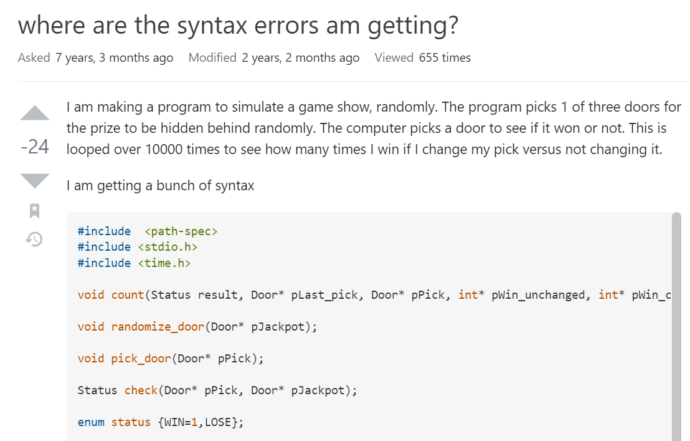
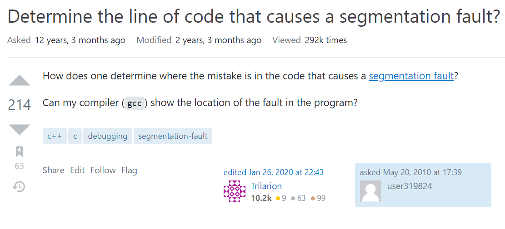

*... haaaalp!*
## A Rookie mistake

<iframe src="https://giphy.com/embed/Dh5q0sShxgp13DwrvG" width="384" height="237" frameBorder="0" class="giphy-embed" allowFullScreen style="float:right"></iframe>
At one point in time or another, a programmer is going to encounter a problem or lapse in knowledge when it comes to a project. Being a prudent and dedicated problem solver, that programmer will go through multiple steps in coming up with a viable solution. Those steps being any of the following:

<ul>
  <li>Reading internet forums.</li>
  <li>Take a break and coming back to it later.</li>
  <li>Asking a friend.</li>
  <li>Asking a colleague.</li>
  <li>Asking a teacher</li>
  <li>Asking the internet.</li>
  <li>Attempting random fixes</li>
  <li>Crying for help(My personal favorite)</li>
</ul>

 
While we are taught basic skills such as interpersonal communication in different  relationships, communication on the internet to a forum or community is often neglected. Like real-world relationships wherever you go, there are nuances and acceptable ways of communicating. Such is also true for programmer hotspots such as <a href="https://stackoverflow.com">StackOverflow</a>.

### Questions the *smart* way
A few years ago, when I began learning C language, I was tasked with creating a program that took user input via the *scanf()* function and displaying it on the console. As easy of a task as it may seem, past me I had a hard time wrapping my head around it. Writing proper syntax was my weakness(in fact, it still is) and I didn't trust my professor at the time to help me without harsh judgment. I took a lot of those steps I gave above, though I didn't know any programmers personally and my introductory programming class was an asynchronous summer course, it left me with little choice, but to ask the all power *People of the Internet* on StackOverflow.
You can imagine my deep regret and sadness when I was met with 5 down votes and 3 comments criticizing the structure of my question. I did what any self-respecting student would do and deleted my question, swearing off asking questions online again. Fastforward a few years later and I've regained a bit of trust and confidence in asking program related questions once more, but that wasn't until I learned how to ask *better questions* or rather, *Smart Questions*.

Eric Raymond makes a good argument for <a href="http://www.catb.org/esr/faqs/smart-questions.html">how to ask questions the smart way.</a> First, he breaks down to seven steps to take BEFORE asking a technical question in by email, newsgroup, or website:
<ol>
  <li>Try to find an answer by searching the archives of the forum or mailing list you plan to post to.</li>
  <li>Try to find an answer by searching the Web.</li>
  <li>Try to find an answer by reading the manual.</li>
  <li>Try to find an answer by reading a FAQ.</li>
  <li>Try to find an answer by inspection or experimentation.</li>
  <li>Try to find an answer by asking a skilled friend.</li>
  <li>If you're a programmer, try to find an answer by reading the source code.</li>
</ol>

Next, he outlines how to choose a proper forum:
<ol>
  <li>Post your question to a forum where it's off topic.</li>
  <li>Post a very elementary question to a forum where advanced technical questions are expected, or vice-versa.</li>
  <li>Cross-post to too many different newsgroups.</li>
  <li>Post a personal e-mail to somebody who is neither an acquaintance of yours nor personally responsible for solving your problem.</li>
</ol>

Finally, he recommends posting to StackOverflow, but not before searching the site for similar questions. Then if nothing is found we can proceed with asking a smart question.

This is a summary of a what a smart question is and isn't based on my interpretation of Eric's writings. A smart question starts with a descriptive title. If I could rewrite my old question today it would go something like, "*C Language scanf() function - returning numbers instead of appropriate string*", versus my no so smart, "*This isn't working. Please help* [picture of the code]". Although, there are probably hundreds of posts I could go through that answer that same problem first; you get the gist. 

  

    
  

When writing our details we should also post our full source code required for stack users to recreate the problems. A 100+ line C program picture would be difficult for anyone to recreate and turn off any would answerers. Posting our code in a code block would display the code neatly and remedy that problem. Finally, we would like to show viewers that we are asking with lots of thought and effort by making sure our post has proper use of grammar, keeping it concise, to the point, and neat.

<a href="https://stackoverflow.com/questions/30449692/where-are-the-syntax-errors-am-getting">This post</a> is and example of a *poor* question. The issue here wasn't so much a grammar, but more so the users lack of care and tone in asking the question. From a viewers perspective it's like the user is saying "Hey, fix this error for me" and shares a program with multiple problems rather than focusing on one problem, as if people would line up gladly and read through every line for them. 

 

  

    
  

Compare that last post with this users <a href="https://stackoverflow.com/questions/2876357/determine-the-line-of-code-that-causes-a-segmentation-fault">smart question</a>. Although it is a short one, instead of begging other users to fix the code for them, they instead ask for the common causes for their errors; in this case for segmentation faults. With 214 upvotes and 63 bookmarks, you can see that stack users were more than open to help that user.

 
 
 

### That's all there is to it
It may seem daunting and nuanced at first, but once you get the hang of it, you will be able to harness the power of tens of hundreds of thousands of programmers all across the globe and it's within your hands to use that power wisely.

  

    
  

