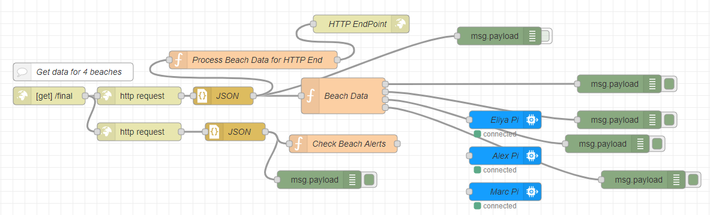
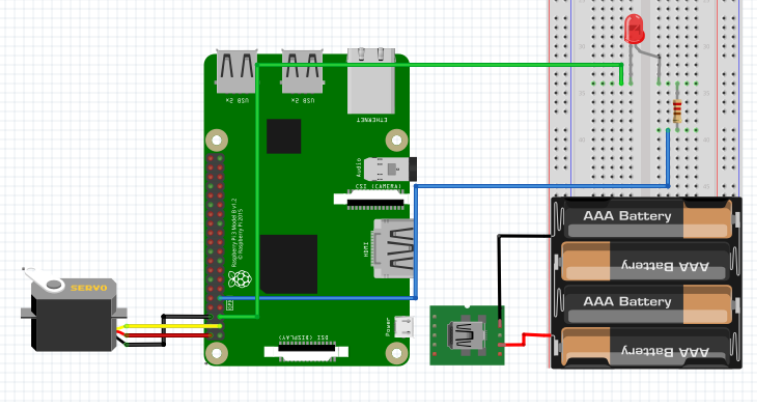

## WatchTower
This project was conducted during the Spring 2022 Semester at the University of Hawaii at Manoa in the Cyber-Physical Systems and IoT course. My team members and I were tasked with developing an IoT device that utilized a web API along with a raspberry pi and sensor kit. During our initial brainstorming process, we came to the conclusion that our design should focus on a local problem we face on our island. A major issue that we all found of high priority is beach and ocean safety. 

There are a wide array of hazards when it comes to the ocean. These are a few statistics reported from the <a href="https://hioceansafety.com/">HI Ocean Safety</a> website.

<ul>
  <li>682 ocean related drownings within a ten year time span</li>
  <li>305 of those drownings came from O'ahu</li>
  <li>Visitors also made up a startling 81 percent of ocean-related spinal cord injuries over the same period</li>
  <li>Visitors are 10x more likely to drown than residents</li>
</ul>

With that in mind, conclulded that our solution should be an outdoor warning system for the many unattended beaches on Hawaii.

<video width="640" height="480" controls>
  <source src="../img/watchtower/watchtower-vid.mp4" type="video/mp4">
Your browser does not support the video tag.
</video>

## Design
Our four man team was split into two sub-teams. One focused on the Beach Safety API and the other, which I was on, focused on the physical device build. We utilized the browser-based flow editor, NodeRed, to receive data from the public API and it's specific information for beaches on different facing beaches on the island of O'ahu. The information would then be sent into a pi node which actuates a servo and LED that displays beach hazard conditions in real time. 

<a href="../reports/WatchTower-IoT-Project.pdf">Final Report</a>

