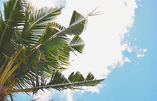

Full Disclosure:
This article used the power of chat-based AI, Bing Chat. 
 

  Orcytes Rhinoceros or Coconut Rhinoceros Beetles (CRB) have made their way to the island of O'ahu and have been wreaking havoc on local palm trees and other plants.  They are invasive pests that attacks palm trees and other plants in Hawaii. It was first detected on O'ahu in December 2013. It is native to Southeast Asia and can grow up to 2 inches long. It bores into the crowns or tops of palm trees where it damages growing tissue and feeds on sap. This can reduce coconut production and kill the tree. The CRB also poses a threat to other native plants such as banana, taro, pineapple, sugarcane, papaya, ginger, heliconia and ti.

 

 <iframe width="560" height="315" src="https://www.youtube.com/embed/3jr3V6kcJzk" title="YouTube video player" frameborder="0" allow="accelerometer; autoplay; clipboard-write; encrypted-media; gyroscope; picture-in-picture; web-share" allowfullscreen></iframe>
 
A Brief Video of CRBs from the University of Guam.

 

## Goal

 This project aims to address the time-consuming task of identifying, counting, and logging geo-location of palms affected by the coconut rhinorceros beetles. This is done using drone image captures at 250ft above ground level(AGL). Once the object-detection model is trained and accurately identifying CRB-infested palms, it can be deployed to receive publicly available drone imagery, identify infested and healthy trees, and scrape GPS metadata from imagery to produce a map of all affected areas which can be useful for predicting CRB movement throughout the island. This model can help redirect man power and resources towards creating solutions for mitigating further infestation.

 

## Process

 Starting with a dataset of 200 flight images of three flights over highly infested areas on the island. The undergraduate students  were tasked with preprocessing the data for the deep learning model. Preprocessing entailed utilizing a virtual environment such as Anaconda Navigator and a high-level interpreted language such as Python for splitting the the image data into 1000x1000 pixel images. Those cropped images totaled to over 7000 new images which were then used the generate labels for the supervised learning set. CRBs leave noticeable markings on palms which are visible from 250ft AGL. A 45 degree notch on the palm fronds can be found on one or both sides of a palm. These markings are labeled as "notch". The palm fronds with visible notches were labeled "infested_frond" and trees with "notch" and "infested_frond" labels were subsequently marked as "infested_tree"s. Unaffected trees were labeled "healthy_frond" and "healthy_tree" accordingly. Once all images are labeled. The data is subdivided into 70-30% split between training and validation for creating the convolutional neural network.

  
   
   
  

 
  The dataset was labeled completely by the end of the course, but is in the process of being cleaned and validated as there were major errors in labeling using older and outdated tools. After the semester ended, I came across other tools such as the <a href="https://roboflow.com/">roboflow application</a> to complete this precessing as well as create an object detection model. Roboflow is a developer tool for building computer vision models faster and more accurately. It streamlines the process between labeling your data and training your model. It also helped identify edge cases and deploy fixes. I was able to generate models with extremely poor accuracy utilizing my own custom Tensorflow Keras, RESNET50 transferred learning CNN, but did not take into account bounding boxes when writing the Google colab script.

  As of 3/10/2023 I have been able to create three Models. The first was using Roboflow's YOLOV8 Model for object detection. Using Roboflow, I was able to create an augmented set to include in my data set and utilized Google Colab to create the model. This rendered the best results of all three of my models.

  

This output was generated utilizing YOLOV8, with the current, poorly labeled data in 25 epochs. As the dataset is cleaned and increased, we can expect the models loss and accuracy to increase.

    <row>
      
      
 The boxes where the labels in the x and y axis intersect is how accurately the model is predicting. For example, we see that the "infested_tree" class is predicted true 78% of the time vs. the "notch" class only accurately predicted 39% of the time.

      
    </row>
     
     
    <row>
      
      
    </row>    
    
 A sample of the predicted objected vs. Actual objects.

  After creating the object detection model, I created an image classification model using Fizyr's Keras-Retinanet Repository on Github. This implementation uses a pyramid network to handle the different scales of the object. 

 

  <row>
    
  </row>

  Lastly, I created a Pytorch DeepForest Model using the Weecology DeepForest GitHub repository. DeepForest is another Keras-Retinanet implementation, but uses a model that was pretrained on crowns of trees, which seemed right for the task.

 

  <row>
    
    
  </row>

## Future

  The next step for this project would be improving the results of the object detection model by increasing the data for better generalization. As we've seen in the YOLOV8 model's confusion matrix output, the AI was fairly accurate in determining an infested tree vs. a healthy one so we can ignore the detection of the other classes and focus solely on determing the infested trees. Once that is complete, we can then deploy the model in a browser or mobile application in any stack using the TensorFlowJS, RoboflowJS libraries.
  
  Now that I have graduated, I am more motivated to see this project to completion and to be able to provide a good resource for combatting the endemic CRB. I am open to help in seeing this project through! Please email me at marcivan@hawaii.edu to get involved!

## About

 
  The project started in the Spring of 2022 during a Biosensors and Instrumention course in the University of Hawaii of Manoa, taught by Professor David Jenkins. The project was overseen by PhD Candidate MS EE Mohsen Paryavi and the original group consisted of Myself, BS CENG Marc Ivan Manalac, BS CENG Destynee Fagaragan, BSEE Zoe Mills, BSEE Monica Ueshima, & BSEE Lorena Urlanda.

  The current state of the data can be found in the <a href="https://universe.roboflow.com/crb/coconut-rhinoceros-beetle-infested-palm-tree-detection">Roboflow site</a>.

