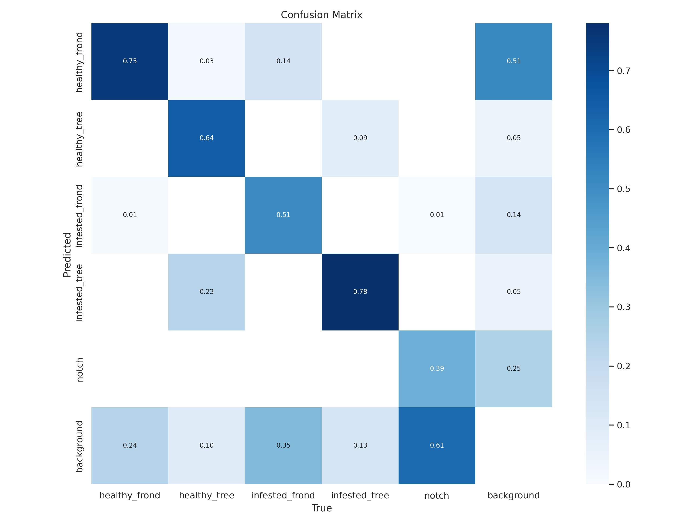

## CRB
Full Disclosure:
This article used the power of chat-based AI, Bing Chat. 
 

Orcytes Rhinoceros or Coconut Rhinoceros Beetles (CRB) have made their way to the island of O'ahu and have been wreaking havoc on local palm trees and other plants.  They are invasive pests that attacks palm trees and other plants in Hawaii. It was first detected on O'ahu in December 2013. It is native to Southeast Asia and can grow up to 2 inches long. It bores into the crowns or tops of palm trees where it damages growing tissue and feeds on sap. This can reduce coconut production and kill the tree. The CRB also poses a threat to other native plants such as banana, taro, pineapple, sugarcane, papaya, ginger, heliconia and ti.

## Goal

This project aims to address the time-consuming task of identifying, counting, and logging geo-location of palms affected by the coconut rhinorceros beetles. This is done using drone image captures at 250ft above ground level(AGL). Once the object-detection model is trained and accurately identifying CRB-infested palms, it can be deployed to receive publicly available drone imagery, identify infested and healthy trees, and scrape GPS metadata from imagery to produce visuals for predicting CRB movement throughout the island. This model can help redirect man power and resources towards creating solutions for mitigating further infestation.

 

  <iframe src="https://giphy.com/embed/2tsYAyWidPCIxnDN5f" width="480" height="270" frameBorder="0" class="giphy-embed" allowFullScreen></iframe>

## Process
Starting with a dataset of 200 flight images of three flights over highly infested areas on the island. The undergraduate students  were tasked with preprocessing the data for the deep learning model. Preprocessing entailed utilizing a virtual environment such as Anaconda Navigator and Python for splitting the the image data into 1000x1000 pixel images. Those cropped images totaled to over 7000 new images which were then used the generate labels for the supervised learning set. CRBs leave noticeable markings on palms which are visible from 250ft AGL. A 45 degree notch on the palm fronds can be found on one or both sides of a palm. These markings are labeled as "notch". The palm fronds with visible notches were labeled "infested_frond" and trees with "notch" and "infested_frond" labels were subsequently marked as "infested_tree"s. Unaffected trees were labeled "healthy_frond" and "healthy_tree" accordingly. Once all images are labeled. The data is subdivided into 70-30% split between training and validation for creating the convolutional neural network.

  
  

  The dataset was labeled completely by the end of the course, but is in the process of being cleaned and validated as there were major errors in labeling using older python tools. I am currently utilizing the <a href="https://roboflow.com/">roboflow application</a> to complete this process. Roboflow is a developer tool for building computer vision models faster and more accurately. It streamlines the process between labeling your data and training your model. It also helps you identify edge cases and deploy fixes. I was able to generate models with extremely poor accuracy utilizing Tensorflow Keras, RESNET50 transferred learning CNN, but did not take into account bounding boxes when writing the Google colab script.

  

This output was generated utilizing YOLOV8, with the current, poorly labeled data in 25 epochs. As the dataset is cleaned and increased, we can expect the models loss and accuracy to increase

    <row>
      
      
    </row>
    <row>
      
      
    </row>    
    
 A sample of the predicted objected vs. Actual objects.

## Future
Now that I have graduated, I am more motivated to see this project to completion and to be able to provide a good resource for combatting the endemic CRB. I am open to help in seeing this project through! Please email me at marcivan@hawaii.edu to get involved!

## About
The project started in the Spring of 2022 during a Biosensors and Instrumention course in the University of Hawaii of Manoa, taught by Professor David Jenkins. The project was overseen by PhD Candidate MS EE Mohsen Paryavi and the original group consisted of Myself, BS CENG Marc Ivan Manalac, BS CENG Destynee Fagaragan, BSEE Zoe Mills, BSEE Monica Ueshima, & BSEE Lorena Urlanda.

The current state of the data can be found in the <a href="https://universe.roboflow.com/crb/coconut-rhinoceros-beetle-infested-palm-tree-detection">Roboflow site</a>.