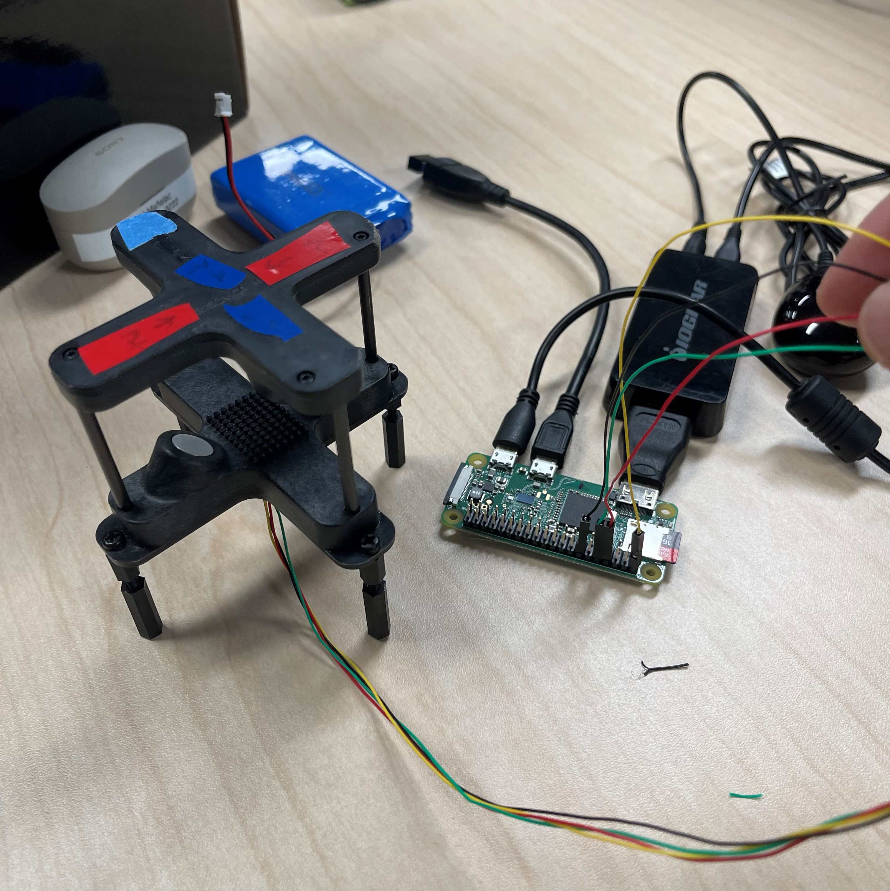

## Summer Internship 2022
During the Summer of 2022, I interned for NIWC Pacific's Unmanned Aerial Vehicle(UAS) team to assist with their ongoing drone projects. One of their tasks were to mount a sensor attached to a computer onto the drone and have it interface with the flight controller to send live telemetry data from that sensor to the ground control station. The true value of this was to have the ability to give the computer the ability to equip any sensor and process the data before sending it downstream to a remote user on the ground. My role was to solve this problem. 

### Challenges
The first challenge was understanding the devices I was to work on. I did research on open source software for flight controllers, the peripheral components that made up a drone, the language they spoke in, and tools and resources available to me for the process. I came up with a surface level understanding of what makes the UAS fly and how to communicate with it. Luckily for me, the systems we were using for the Autopilot(AP), Ground Control Station(GCS), and related hardware was well documented in the <a href="https://docs.px4.io/main/en/">PX4</a> and <a href="https://ardupilot.org/dev/index.html">ArduPilot</a> websites. Both sources also offered a large community for support for hobbyist and companies alike.

<div class="text-center p-4">
  <div class="zoom-within-container">
    
    
    
  </div>
</div>

Second, I needed to create a program that can log the data from the sensor to the raspberry pi. Through the documentation of the sensor I was able to configure it to transmit a specific size and timeframe for the data. I also used python to create a new file, read, and write the incoming data each time it was executed. The data also needed to be in tranlsated into the native language of the UAS known as the MAVLink protocol. To do this, I utilized the serial library to establish a read in the sensor data and the pymavlink library to create a mavlink connection with the GCS, encode the data into the appropriate protocol and transfer broadcast it via UDP. 

```python
# Naming and creating file for Sensor Log
dt =  str(datetime.datetime.now().strftime("%Y_%m_%d_%H_%M_%S"))
filename = 'SENSOR_SAMPLE' + dt +'.txt'
f = open(filename , 'w')
#Set Up Serial Port for the sensor
ser = serial.Serial(
        '/dev/ttyACM0',
        baudrate = 115200,
        parity=serial.PARITY_NONE,
        stopbits=serial.STOPBITS_ONE,
        bytesize=serial.EIGHTBITS,
        timeout=1
)
# Setup MAVLink to connect on udp 127.0.0.1:14550
conn = mavutil.mavlink_connection("udp:127.0.0.1:14550", autoreconnect=True, source_system=1, 
                                  force_connected=False, source_component=mavutil.mavlink.MAV_COMP_ID_PERIPHERAL)
# wait for the heartbeat msg to find the system ID
while True:
    if conn.wait_heartbeat(timeout=0.5) != None:
        # Got a heartbeat from remote MAVLink device, good to continue
        break
#The program will continue to write into the file until it is terminated.
while 1:
    # convert from bytes to string then strip any whitespace
    data = ser.read(100).decode("utf-8").strip()
    if data != '':
        #debugs printer
        print(data)
        #writes to MAVLink as a STATUSTEXT message, encoded as ASCII
        conn.mav.statustext_send(mavutil.mavlink.MAV_SEVERITY_INFO, data.encode())
f.close()
```

Then finally, used a <a href="https://github.com/mavlink-router/mavlink-router">MAVLink Router</a> command inside of a bash script to transmit the data from the Pi to the flight controller via mavlink. 

### Results
I was given a <a href="https://anemoment.com/features/">Trisonica mini weather sensor</a> to use as the first device to test, along with a <a href="https://www.raspberrypi.com/products/raspberry-pi-zero/">Raspberry Pi Zero</a>, and an <a href="https://mrobotics.io/docs/mro-x2-1-rev2/">mro x2.1 flight controller</a> and was able to display the data on the GCS as obstructed upon running the bash script on the onboard companion computer. My next step now is to be able to collect the data outside of the GCS and plot data using a python script so we can visualize the live telemtry using data science. While there are some setbacks and difficulties with this next step, I am excited to continue working on the project and learn more about open source drones!
<div class="text-center p-4">
    <div class="zoom-within-container">
    
    
  </div>
</div>