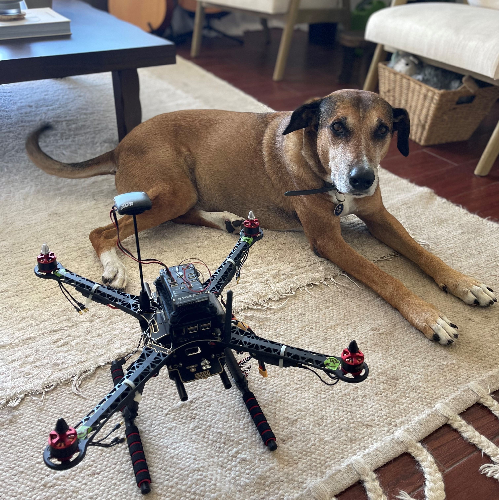
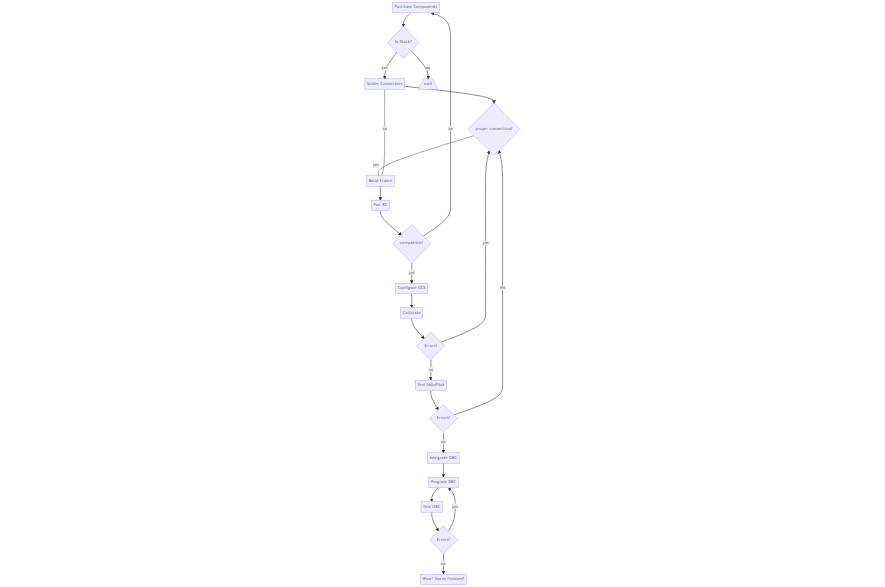

I have been experimenting with building drones that use open source software. The two most popular 'autopilots' are called PX4 and ArduPilot. The software is loaded onto a flight controller which controls the drones peripherals such as GPS, SiK Telemetry Radios, Receivers, and is also equipped with an inertial measurement units for handling flight behavior. The flight controller then sends this data down to a Ground Control Station(GCS) via the open source middleware MAVLink protocol. 

The power of the software lies in it's autonomous capabilities. With either of the autopilots, we are able to create waypoints, set missions, and affect the vehicles behavior with a variety of sensors and secondary devices. In my project, I am equipping the vehicle with an onboard computer companion raspberry pi, which will act as an autonomous pilot that gives commands to the vehicle based on it's programmed responses to it's inputs. Moving forward, I plan on experimenting on open source computer vision libraries such as OpenCV to control the vehicle based on video feedback response. I also plan on using a Lidar to conduct autonomous 3d mapping of terrains.

Currently, I am in an iterative process to get my drone in the air solely with it's avionics and without a computer companion. I initially believed that the process would be a linear one, but have recently learned that there are certain restraints and setbacks such as supply chain issues, hardware malfunctions, firmware version bugs, and knowledge bottlenecks.

