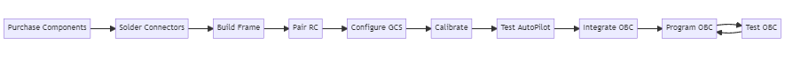

### About Open Source Drone Building

I have been experimenting with building drones that use open source hardware and software starting in the middle of Summer 2022. The two most popular *autopilot* softwares are called PX4 and ArduPilot. The software is loaded onto a flight controller which controls the drones motors, esc's, and peripherals such as GPS, SiK Telemetry Radios, Receivers. The flight controller then sends this data down to a Ground Control Station(GCS) via the open source middleware MAVLink protocol. This image below shows the standard layout using the open standard pixhawk hardware.

### Relevance to Engineering
Drones have become widely available for public and private users with a growing array of applications. Not only do they make for extraordinary cinematic videos, but they are also capable of being equipped with a multitude of sensors  and computers to conduct complex tasks such as spraying pesticides within an area, counting livestock, mapping live wildfires and more. I found that building a drone would allow me to put my new found engineering knowledge to practical use. Some tasks I would need to complete to get started are:
<ol>
<li>Create circuit diagrams to map out the vehicle, computer, and sensor current draw and power.</li>
<li>Calculate flight time based on weight, thrust, and battery capabilities</li>
<li>Program the onboard computer companion to manage processes for sensors manage communicating with AutoPilot</li>
<li>Program Ground Control Station to receive and analyze incoming data</li>
<li>3D print custom housing to fix components onto system</li>
</ol>

### Planning 
The power of the software lies in it's autonomous capabilities. With either of the autopilots, we are able to create waypoints, set missions, and affect the vehicles behavior with a variety of sensors and secondary devices. All of this can be done without a pilot directly controlling the drone through a transmitter. 
In my project, I am equipping the vehicle with an onboard computer companion raspberry pi, which will act as an autonomous pilot that gives commands to the vehicle based on it's programmed responses to it's inputs. Moving forward, I plan on experimenting on open source computer vision libraries such as OpenCV to control the vehicle based on video feedback response. I also plan on using a Lidar to conduct autonomous 3d mapping of terrains.

I initially believed that the process would be a linear one, but I have recently learned that there are certain restraints and setbacks such as supply chain issues, hardware malfunctions, firmware version bugs, and knowledge bottlenecks that make for a more complex process.

### Progress
At the time of writing this, I am in an iterative process to get my drone in the air solely with it's avionic components and without a computer companion or extra sensors. I am currently in the calibration and test autopilot phase of my schedule, I'm hoping to get flying by the end of the Fall 2022 semster.

