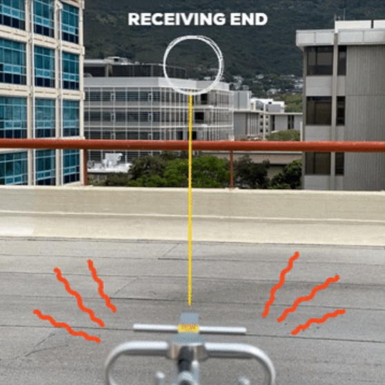

SCADA Lab was a two-semester long capstone(currently ongoing) that allowed EE,ICS, & CENG students to experience designing and building a system in a faux-engineering company manner. 

## What is SCADA

SCADA is blah

## My experience

SCADA is dakines.
