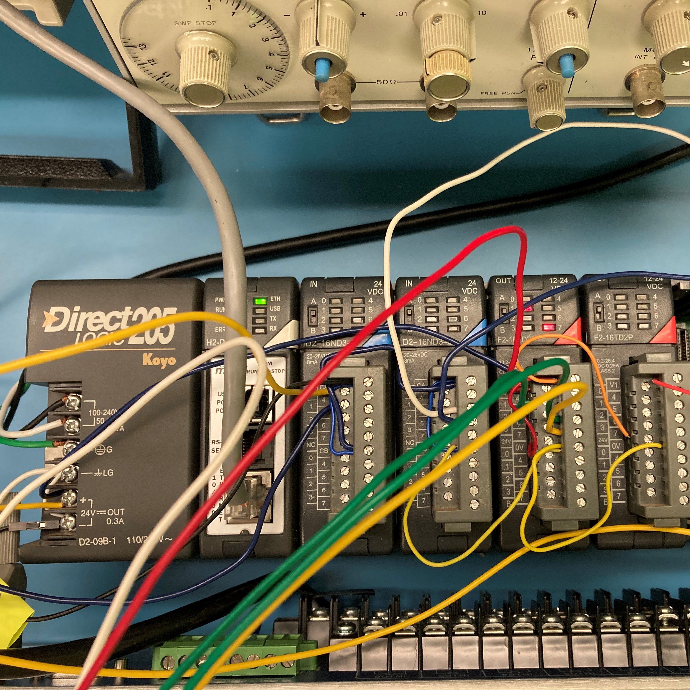

## What is SCADA
SCADA Lab was a two-semester long capstone(currently ongoing) that allowed EE,ICS, & CENG students to experience designing and building a system in a faux-engineering company manner. The term SCADA stands for Supervisory Control and Data Acquisistion. It is any closed-loop self regulating system that utilizes sensors and actuators to interface with the real world. These systems can be found in major infrastructure such as traffic systems, utilities, railways, airports and more.

## Our Design
Our system was to emulate a network of a power utility company such as HECO. On one end we have actuators such as power transmission line protection and high power relays which are connected via a wireless gateway and controlled and monitored by a user in a private network through yagi antennas.

  
  
  
  

## My experience
Not only was it a valuable learning experience, but I was able to enjoy team bulding and communicating to solve problems with fellow students with different STEM backgrounds. We also participated in a end of semester Defense Innovation Mixer where we presented our design project and viewed different projects related to solving real world problems.

<link src="../reports/scada_report_fall21.pdf">

